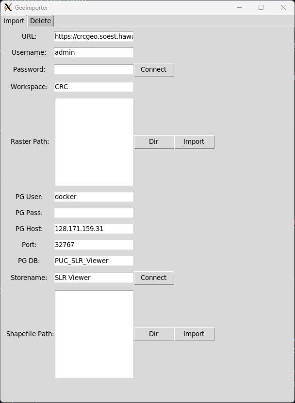

# Geoimporter

## About

Tool to import raster/shapefile layers into the Geoserver using Python package for Geoserver REST API. The interface is built with
tkinter GUI package. The tool allows users to set a directory for the layers to import and streamline the process of publishing the layers
on to the Geoserver application. The tool will go into every subdirectory and import only files with .shp or .tif extension. Shapefiles
are imported into a PostgreSQL/PostGIS DB, and then they are published on Geoserver. Therefore, the tool will need to be able to connect
to a PostgreSQL/PostGIS DB. The tool has been created to have a graphical interface for the importing scripts.

## Packages Used

- [tkinter](https://docs.python.org/3/library/tkinter.html)
- [geopandas](https://geopandas.org/en/stable/index.html)
- [sqlalchemy](https://www.sqlalchemy.org)
- [geoserver-rest](https://geoserver-rest.readthedocs.io/en/latest/)

## Requirements

Python 3.7 or higher
Python-3-dev Package
GDAL 3.2 or higher~

## Quick Setup

Install dependency packages including debian packages:
configuration.bat: windows
configuration.sh: debian linux


## Environment Setup

Execute `pip install -r requirements.txt` to install version of the packages that the tool was developed with.

## Installing TK

### Windows

Tkinter should be a default packages that is installed in Python packages, so there should not be any further configuration.

### Debian-based Distro

You will need to install python tk package with command below:

```
sudo apt-get install python3-tk
```

Or you can build from source

source: https://tkdocs.com/tutorial/install.html

## Installing GDAL

### Windows

You will have to use an extension package for GDAL in order to run on Windows. Be sure to use the corresponding python version (ex. GDAL-3.4.1-cp39-cp39-win_amd64.whl for python version 3.9) Use the link below to download the file:

https://www.lfd.uci.edu/~gohlke/pythonlibs/#gdal

Run the code to install the extension

```
pip install D:\Downloads\GDAL-3.4.1-cpXX-cpXX-win_amd64.whl
```

You can also use Conda to install all of the dependencies for the project. However, if you intend on using PyInstaller, there will be conflicts between default conda packages and pyinstaller packages on **Windows**

Source: https://stackoverflow.com/questions/70892737/trying-to-install-gdal-python-3-9-9-pip-windows-10

### Debian-based Distro

https://mothergeo-py.readthedocs.io/en/latest/development/how-to/gdal-ubuntu-pkg.html

If you are running a linux distro, run the command below to install the correct GDAL version

```
ip install GDAL==$(gdal-config --version | awk -F'[.]' '{print $1"."$2}')
```

## Instructions



### Add Geoserver and Postgres Environment Variables

- Inside .env, input geoserver information for default value for text input.(Makes workflow quicker)

### Connect to Geoserver

1. Insert geoserver URL
2. Insert geoserver username
3. Insert geoserver password
4. Click Connect button
5. Insert workspace name in Workspace field
6. Click "Dir" button
5a. Navigate to path that the raster files are stored and select files
7. Click Import

### Connect to PostgreSQL/PostGIS DB

1. Insert Postgres user in PG User
2. Insert Postgres password in PG Pass Field
3. Insert Postgres ip address or hostname in PG Host Field
4. Insert Postgres port in Port field
5. Insert Postgres DB into PG DB field
6. Click DB Connect
7. Click Dir
8. Navigate to path that the shapefiles are stored and select files
9. Click Import

### Delete from Geoserver

1. Go to Delete tab at the top
2. Type in layer/table name if necessary in input bar
3. Click search button
4. Click layer/s that need to be deleted
5. Click delete button
